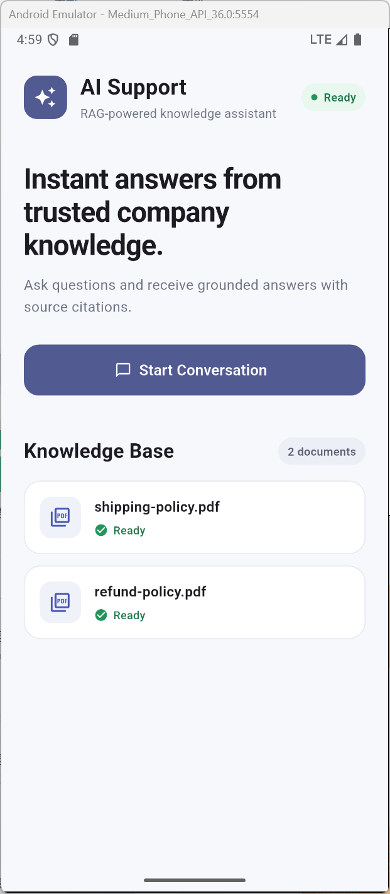
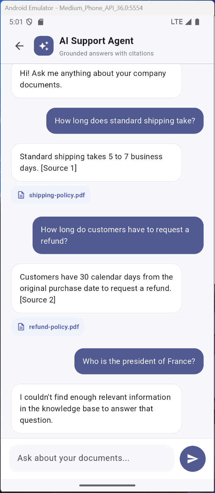

# AI Support Mobile

A Flutter mobile client for a RAG-powered AI customer support platform.

The app connects to an AI support backend and allows users to browse the available knowledge base, ask questions about company documents, and receive grounded answers with source citations.

## Screenshots

<p align="center">
  
  &nbsp;&nbsp;&nbsp;
  
</p>

## Features

- Flutter mobile interface for Android and iOS
- Integration with a REST API backend
- Dynamic knowledge base loaded from the backend
- RAG-powered document Q&A
- Grounded AI responses
- Source citations for generated answers
- Graceful handling of questions outside the knowledge base
- Loading and error states
- Clean Material 3 interface

## Architecture

```text
Flutter Mobile App
        │
        ├── GET /api/documents
        │       │
        │       └── Knowledge Base
        │
        └── POST /api/chat
                │
                ▼
        AI Support Backend
                │
                ├── Document Retrieval
                ├── Vector Search
                ├── LLM Generation
                └── Source Citations
```

The mobile application is designed as a client for the separate AI Support Agent backend, which handles document ingestion, retrieval, and LLM-based answer generation.

## Tech Stack

- Flutter
- Dart
- Material 3
- REST API integration
- RAG / LLM backend integration

## Related Project

This mobile client integrates with **AI Support Agent**, a full-stack RAG customer support platform built with:

- Go
- Next.js
- PostgreSQL / pgvector
- Docker
- LLM APIs
- Embedding-based semantic search
- PDF knowledge base ingestion

## Demo Scenario

The included demo knowledge base contains example shipping and refund policies.

Users can ask questions such as:

> How long does standard shipping take?

The application retrieves relevant company knowledge and returns a grounded answer together with its source document.

Questions that cannot be answered from the available knowledge base are rejected instead of generating unsupported answers.

## Purpose

This project demonstrates how an existing AI/RAG backend can be integrated into a production-style Flutter mobile experience.

It is intended as a portfolio project showcasing Flutter development, REST API integration, AI application development, and full-stack system integration.